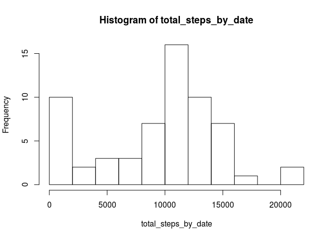
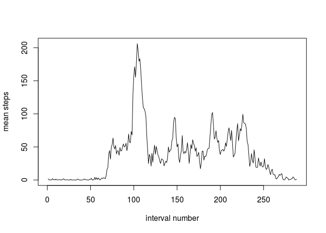
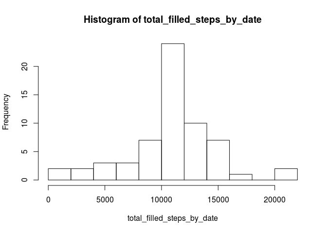
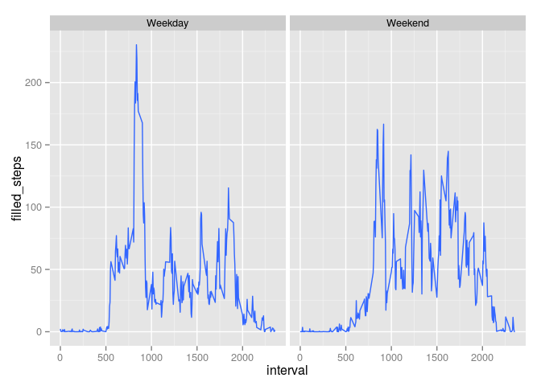

# Reproducible Research: Peer Assessment 1
C.Bao  


## Loading and preprocessing the data
First let's load the data. Here I assume the .csv table from the zipped file is saved in the current working directory.


```r
data <- read.csv("activity.csv",na.string="NA")
```

## What is mean total number of steps taken per day?

Here I just simply ignore the missing values while calculate the total number of steps. A histogram of total number of steps per day is plotted. The summary of the total number of steps per day is shown, which includes the median and the mean of the statistics.


```r
data_by_date<-split(data,data$date)
total_steps_by_date <- sapply(data_by_date,function(x) sum(x$steps,na.rm=TRUE))
hist(total_steps_by_date,breaks=10)
```

 

```r
summary(total_steps_by_date)
```

```
##    Min. 1st Qu.  Median    Mean 3rd Qu.    Max. 
##       0    6778   10400    9354   12810   21190
```
As we can see from the histogram, simply ignoring the missing values results in a high frequency bin at 0. We will take a closer look at this problem later in this document.

## What is the average daily activity pattern?

In this part I calculates the number of steps in each 5-minutes interval averaged across all days.


```r
data_by_interval<-split(data,data$interval)
mean_steps_in_interval<-sapply(data_by_interval,function(x) mean(x$steps,na.rm=TRUE))
#plot(as.numeric(names((mean_steps_in_interval))),mean_steps_in_interval,type="l",xlab="interval",ylab="mean steps")
plot(mean_steps_in_interval,type="l",xlab="interval number",ylab="mean steps")
```

 

```r
max_steps_interval <- names(which.max(mean_steps_in_interval))
max_steps_interval_num <- which.max(mean_steps_in_interval)
```
I choose to plot against the interval number instead of the interval identifier because there is some discontinuity in the indentifier, i.e. from 55 to 100 etc., due to the fact there is 60 minutes per hour.

The number of steps in each interval varies across the day. The maximum number of steps happens in the 104th interval with identifier 835. This corresponds to the time 8:35am in the morning. I guess that's when people are rushing to work?

## Imputing missing values
Now let's address the problem with the missing values. First let's see how many missing values there are in the data set.

```r
sum(is.na(data$steps))
```

```
## [1] 2304
```

```r
dim(data)
```

```
## [1] 17568     3
```
We can see there are 2304 out of 17568 observations missing, which is around 13% of the total data. This is not a neglegible portion of the data. Instead of simply ignoring the missing values, here the strategy to handle the missing values is to fill those in with mean steps in that particular interval averaged across all available days. 


```r
data$mean_interval_steps <- mean_steps_in_interval
data$filled_steps <- data$steps
data$filled_steps[is.na(data$steps)] <- data$mean_interval_steps[is.na(data$steps)]
```

Then let's check the histogram, mean and median of total number of steps per day with the filled data.


```r
filled_data_by_date<-split(data,data$date)
total_filled_steps_by_date <- sapply(filled_data_by_date,function(x) sum(x$filled_steps,na.rm=TRUE))
hist(total_filled_steps_by_date,breaks=10)
```

 

```r
summary(total_filled_steps_by_date)
```

```
##    Min. 1st Qu.  Median    Mean 3rd Qu.    Max. 
##      41    9819   10770   10770   12810   21190
```
Now we can see from the histogram that the 'fake' high frequency bin at 0 has dissappeared. After imputing the missing data, the mean and median of the total number of steps per day has increased. Because the missing values now counts as some mean number rather than 0. 

## Are there differences in activity patterns between weekdays and weekends?
For this part I will check whether there is any differences in activity patterns between weeekdays and weekends. First I create a lable for each row indicating whether it is weekday or weekend.


```r
data$weekend <- as.factor(weekdays(as.Date(data$date,"%Y-%m-%d")) %in% c("Saturday","Sunday"))
levels(data$weekend) <- c("Weekday","Weekend")
```

Then I use ggplot2 library to create panel plots comparing the mean number of steps in each interval averaged across all days in each category.


```r
library(ggplot2)
qplot(interval,filled_steps,data=data,facets=.~weekend,stat="summary",fun.y="mean",geom="smooth")
```

 

We can see clearly from the comparison that the dominant peak in weekday at 8:35 or so dissappears in the weekend activity pattery. This is clearly because people don't have to make it to their job at 9am. People sleep in during weekend at rather different time, so there is a graduate increase of activity in the morning 
rather than a sharp increase shortly after 5am.
